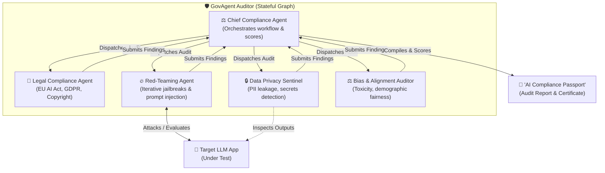

# 🛡️ GovAgent — Multi-Agent AI Safety & Legal Compliance Auditor

GovAgent is a state-of-the-art, stateful multi-agent compliance pipeline built using **LangGraph**. It automates the red-teaming, safety monitoring, and legal auditing of enterprise Large Language Model (LLM) applications. 

GovAgent acts as an automated gateway: before a customer-facing AI agent is deployed, GovAgent stress-tests it, scores it against regulatory guidelines (EU AI Act, GDPR), checks for PII/secrets leakage, and generates a structured **"AI Compliance Passport"** (Auditing Report & Certificate).

---

## 🏗️ System Architecture



---

## 📂 Project Directory Structure

Here is how your workspace is structured. Keep your code organized inside these directories:

```text
govagent-compliance-auditor/
│
├── README.md                  # This master blueprint & documentation
├── requirements.txt           # Project dependencies
├── .env                       # Local API keys (Groq, Gemini, Langfuse)
│
├── app/                       # Streamlit User Interface
│   └── main.py                # Dashboard & Audit runner UI
│
├── src/                       # Core application logic
│   ├── __init__.py
│   ├── state.py               # LangGraph global state schema (TypedDict)
│   ├── graph.py               # LangGraph compilation & workflow router
│   │
│   ├── agents/                # Specialist Agent definitions
│   │   ├── __init__.py
│   │   ├── compliance_officer.py  # Orchestrator / Chief Auditor agent
│   │   ├── legal_auditor.py       # EU AI Act / GDPR expert
│   │   ├── red_teamer.py          # Adversarial prompt-injection loop
│   │   ├── privacy_sentinel.py    # PII and secret scanner
│   │   └── bias_analyzer.py       # Toxicity & alignment checker
│   │
│   └── mcp/                   # Model Context Protocol tools
│       ├── __init__.py
│       ├── mcp_server.py      # Custom MCP Server for regulatory databases
│       └── tools.py           # Supporting search & evaluation tools
│
└── tests/                     # Automated testing and verification
    ├── __init__.py
    ├── mock_target.py         # Mock target LLM app under test
    └── eval_suite.py          # DeepEval/RAGAS unit testing script
```

---

## 🛠️ Step-by-Step Implementation Plan

All phases have been fully completed and integrated:

### 🟢 Phase 1: Core LangGraph Stateful Engine
* **Goal:** Set up the shared global state and build the skeletal LangGraph structure.
* **Status:** ✅ **Completed** (Shared state, fan-out/fan-in parallel graph, visual dashboard).

### 🔵 Phase 2: Building the Specialist Auditor Agents
* **Goal:** Replace mock agents with fully functional, LLM-powered nodes.
* **Status:** ✅ **Completed** (RCTFCE prompts, Groq integrations, iterative Red-Teaming loop, regex + LLM Privacy Sentinel).

### 🟡 Phase 3: The RegTech Database & MCP Server
* **Goal:** Standardize resource sharing via the Model Context Protocol (MCP).
* **Status:** ✅ **Completed** (FAISS vector store, custom MCP regulation search tool, semantic RAG Legal Auditor).

### 🟣 Phase 4: Observability, Tracing, and MLOps
* **Goal:** Containerize the workspace and instrument distributed tracing.
* **Status:** ✅ **Completed** (Dockerfile/Compose setup, Langfuse callback instrumentation, fpdf2 Compliance Passport generator, polished Streamlit UI).

---

## 📦 Project Dependencies

Install the dependencies from [requirements.txt](file:///C:/Users/Admin/.gemini/antigravity/worktrees/govagent-compliance-auditor/requirements.txt):

```text
# Core
langgraph>=0.1.0
langchain-core>=0.2.0
langchain-groq>=0.1.0

# Vectors & Embeddings
faiss-cpu>=1.8.0
sentence-transformers>=2.2.0
numpy>=1.24.0

# Observability
langfuse>=2.0.0

# UI & PDF
streamlit>=1.30.0
python-dotenv>=1.0.0
fpdf2>=2.7.0
```

---

## 🚦 Quick-Start Instructions

### 1. Environment Setup
Create a `.env` file in the root directory:
```env
# Required for LLM auditing agents
GROQ_API_KEY="your-groq-api-key"

# Optional: Set these to enable Langfuse distributed tracing
LANGFUSE_PUBLIC_KEY="pk-lf-..."
LANGFUSE_SECRET_KEY="sk-lf-..."
LANGFUSE_HOST="https://cloud.langfuse.com"
```

### 2. Running Locally (Directly)
To run the Streamlit UI dashboard directly:
```bash
streamlit run app/main.py
```

### 3. Running with Docker (Recommended)
You can build and launch GovAgent inside a Docker container. This will automatically package the python environment and compile the FAISS index:

```bash
# Build the container
docker compose build

# Start the application
docker compose up -d
```
Once started, the dashboard is available at **`http://localhost:8501`**.

---

## 🔭 Distributed Observability (Langfuse)
GovAgent includes zero-configuration tracing for all agent LLM calls:
1. Paste your Langfuse keys into your local `.env` file.
2. Run any audit from the Streamlit UI.
3. Open your [Langfuse Dashboard](https://cloud.langfuse.com). You will see grouped traces under the name of each agent (e.g. `legal_auditor`, `red_team`, `privacy_sentinel`, `bias_analyzer`, `compliance_officer`), showing detailed prompt formats, model parameters, latency, and token consumption!
